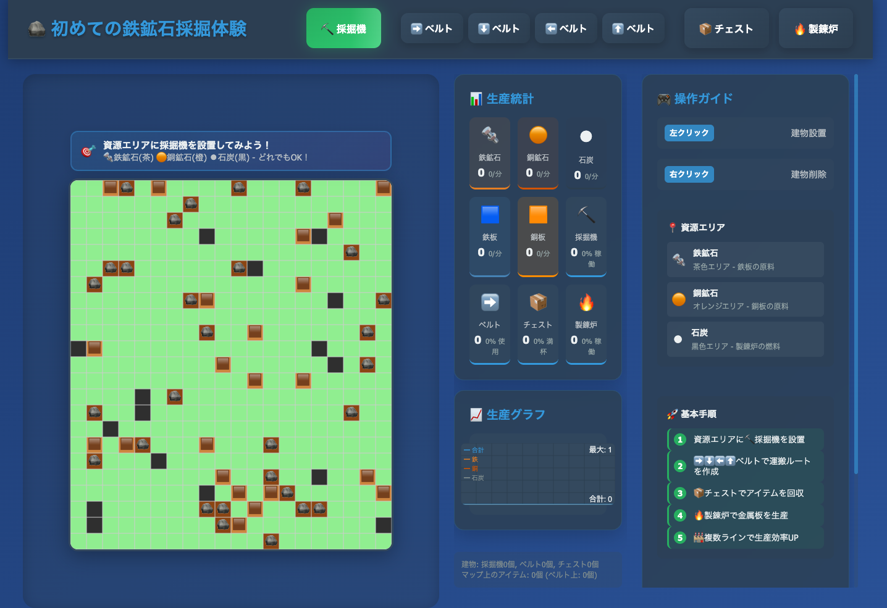

# 生産密度チャレンジ

限られた資源で最高効率の工場を作り、生産密度スコアを競うシミュレーションゲームです。採掘機、ベルトコンベア、製錬炉を使って効率的な生産ラインを構築しましょう！



## 🎮 ゲームの特徴

- **スコアチャレンジ**: 生産密度スコアでベストスコアを目指す
- **固定資源配置**: 全プレイヤーが同じ条件で競える公平性
- **シンプルな操作**: マウスクリックだけで建物を設置・削除
- **リアルタイム統計**: 効率グラフで工場の稼働状況を可視化
- **製錬システム**: 鉱石と石炭から金属板を生産
- **4方向ベルト**: 上下左右に自由な運搬ラインを構築

## ⚡ クイックスタート

```bash
# 1. リポジトリをクローン
git clone https://github.com/HamadaKoji/iron-ore-mining-experience.git
cd iron-ore-mining-experience

# 2. ローカルサーバーを起動
python3 -m http.server 8000

# 3. ブラウザでアクセス
open http://localhost:8000
```

**または、オンライン版で今すぐプレイ:**
👉 **https://hamadakoji.github.io/iron-ore-mining-experience/**

## 🎯 ゲームの目的

**生産密度スコア = 金属板生産量 × 稼働効率**

- 金属板生産量を最大化
- 稼働中の採掘機と製錬炉を増やす
- 無駄な建物を減らして効率を上げる
- ベストスコアの更新を目指す

## 🚀 プレイ方法

### 基本的な流れ
1. **🔩🟠⚫ 資源エリアを確認** - 鉄（茶）、銅（橙）、石炭（黒）
2. **⛏️ 採掘機を設置** - 各資源エリアに採掘機を配置
3. **➡️ ベルトで運搬** - 採掘機から製錬炉へ資源を運搬
4. **🔥 製錬炉で加工** - 鉱石と石炭から金属板を生産

### 操作方法
- **左クリック**: 建物設置
- **右クリック**: 建物削除
- **ツールバー**: 設置する建物を選択
- **リセットボタン**: 工場をリセット（ベストスコアは保持）

### スコアリングのコツ
- 稼働率の高い工場設計を心がける
- 資源の流れが止まらないようにする
- 必要最小限のベルトで効率的に接続
- 製錬炉への資源供給を絶やさない

## 🚀 ローカル環境での動作確認

### 方法1: Python内蔵サーバー（推奨）

```bash
# プロジェクトディレクトリに移動
cd /path/to/factory-game

# Pythonサーバーを起動
python3 -m http.server 8000
```

ブラウザで以下にアクセス：
- **ゲーム**: http://localhost:8000
- **テスト**: http://localhost:8000/test.html

### 方法2: npm開発サーバー

```bash
# プロジェクトディレクトリに移動
cd /path/to/factory-game

# npm開発サーバーを起動
npm run dev
```

### 方法3: 別のポートを使用する場合

```bash
# ポート8000が使用中の場合
python3 -m http.server 8001
python3 -m http.server 8002
# など、任意のポート番号を指定
```

### 🔧 トラブルシューティング

#### サーバーが起動しない場合
```bash
# ポートが使用中かチェック
lsof -ti:8000

# 使用中のプロセスを停止
kill [プロセスID]

# または別のポートを使用
python3 -m http.server 8080
```

#### ブラウザでエラーが出る場合
1. **開発者ツール**（F12）でエラーを確認
2. **ハードリロード**（Ctrl+Shift+R / Cmd+Shift+R）
3. **キャッシュをクリア**してリロード
4. **モダンブラウザ**（Chrome, Firefox, Safari）を使用

#### ファイルが更新されない場合
```bash
# ハードリロードまたはキャッシュクリア
# Chrome: Ctrl+Shift+R (Windows) / Cmd+Shift+R (Mac)
# Firefox: Ctrl+F5 (Windows) / Cmd+Shift+R (Mac)
```

### 📱 動作確認のポイント

#### 基本機能
- ✅ ツールバーのボタン選択
- ✅ 建物の設置・削除（左クリック/右クリック）
- ✅ アイテムの流れ（採掘→ベルト→製錬炉）
- ✅ 生産密度スコアの計算とベストスコア記録

#### ゲーム要素
- ✅ **固定資源**: 鉄25個、銅20個、石炭15個
- ✅ **クラスター配置**: 5-9個のまとまりで配置
- ✅ **効率グラフ**: 5分間の効率推移表示
- ✅ **リセット機能**: ベストスコアを保持したままリスタート

## 📚 開発ドキュメント

- **[開発ガイドライン](DEVELOPMENT.md)** - 開発の進め方、コーディング規約、ブランチ戦略
- **[アーキテクチャ設計書](ARCHITECTURE.md)** - システム設計、モジュール構成、拡張方針
- **[貢献ガイド](CONTRIBUTING.md)** - 機能追加の手順、テスト要件、レビュープロセス
- **[開発ロードマップ](ROADMAP.md)** - 今後の機能追加計画、優先順位、マイルストーン
- **[ゲーム仕様書](GAME_SPECIFICATION.md)** - 詳細な仕様とルール
- **[AI開発支援ガイド](CLAUDE.md)** - AIアシスタント向けのプロジェクト情報

## 🧪 テスト

このプロジェクトには包括的なユニットテストが含まれています。

### テスト実行方法

**ブラウザでテスト実行:**
```bash
# ローカルサーバーを起動
npm run dev
# または
python3 -m http.server 8000

# ブラウザで http://localhost:8000/test.html にアクセス
```

**コマンドラインでテスト実行:**
```bash
npm test
# または
node tests/run-tests.js
```

### テスト内容
- **地形生成テスト**: 固定資源数、クラスター配置の検証
- **建物管理テスト**: 建物の設置・削除、制約チェック
- **アイテム管理テスト**: アイテムの移動、製錬処理

### コード構造
```
src/
├── config.js          # ゲーム設定・定数
├── terrain.js         # 地形生成（クラスター配置）
├── buildings.js       # 建物管理
├── items.js          # アイテム管理
├── renderer.js       # 描画処理
├── game.js           # メインゲームクラス・スコア計算
├── efficiency-chart.js # 効率グラフ描画
└── main.js           # エントリーポイント

tests/
├── test-framework.js  # テストフレームワーク
├── terrain.test.js    # 地形テスト
├── buildings.test.js  # 建物テスト
├── items.test.js     # アイテムテスト
└── run-tests.js      # テスト実行
```

## 🛠️ 技術仕様

- **言語**: HTML5, CSS3, JavaScript (Vanilla)
- **外部ライブラリ**: なし
- **ブラウザ**: モダンブラウザ対応
- **ストレージ**: LocalStorageでベストスコア保存

## 📁 ファイル構成

```
factory-game/
├── index.html              # メインHTML
├── style.css              # スタイルシート
├── src/                   # ソースコード
├── tests/                 # テストスイート
├── GAME_SPECIFICATION.md  # 詳細仕様書
├── CLAUDE.md             # AI開発支援ガイド
└── README.md              # このファイル
```

## 🎯 学習目標

このゲームを通じて以下を学べます：
- 効率的な生産ラインの設計
- リソース管理と最適化
- システム思考とボトルネック解消
- 継続的な改善とスコア向上

## 🚀 今後の拡張予定

- [x] 新しい資源タイプ（銅鉱石、石炭）✨ **完了！**
- [x] リアルタイム統計とグラフ ✨ **完了！**
- [x] 製錬システム ✨ **完了！**
- [x] 4方向ベルトシステム ✨ **完了！**
- [x] 生産密度スコアシステム ✨ **完了！**
- [x] ベストスコア記録 ✨ **完了！**
- [x] 固定資源配置 ✨ **完了！**
- [ ] オンラインランキング
- [ ] より複雑な加工機械（組立機）
- [ ] 研究・技術ツリー
- [ ] サウンド効果とBGM

## 🤝 貢献

バグ報告や機能提案は Issues でお気軽にどうぞ！

## 📄 ライセンス

MIT License

---

**最高の生産密度スコアを目指してチャレンジしよう！** 🏭✨