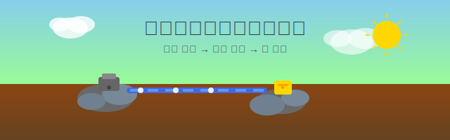

# 初めての鉄鉱石採掘体験

Factorio風のシンプルな工場シミュレーションゲームです。採掘機、ベルトコンベア、チェストを使って鉄鉱石の採掘・運搬・回収システムを構築しましょう！



## 🎮 ゲームの特徴

- **シンプルな操作**: マウスクリックだけで建物を設置・削除
- **視覚的な理解**: 絵文字を使った分かりやすいUI
- **リアルタイム**: アイテムが実際に流れる様子を観察
- **教育的**: 工場自動化の基本概念を学習
- **複数資源**: 鉄鉱石、銅鉱石、石炭の3種類の資源

## ⚡ クイックスタート

```bash
# 1. リポジトリをクローン
git clone https://github.com/HamadaKoji/iron-ore-mining-experience.git
cd iron-ore-mining-experience

# 2. ローカルサーバーを起動
python3 -m http.server 8000

# 3. ブラウザでアクセス
open http://localhost:8000
```

**または、オンライン版で今すぐプレイ:**
👉 **https://hamadakoji.github.io/iron-ore-mining-experience/**

## 🚀 プレイ方法

### 基本的な流れ
1. **🪨 鉱石エリアを見つける** - 茶色のエリアが鉄鉱石です
2. **⛏️ 採掘機を設置** - 鉱石エリアに採掘機を配置
3. **➡️ ベルトで運搬** - 採掘機からチェストまでベルトを敷設
4. **📦 チェストで回収** - ベルトの終点にチェストを設置

### 操作方法
- **左クリック**: 建物設置
- **右クリック**: 建物削除
- **ツールバー**: 設置する建物を選択

## 🚀 ローカル環境での動作確認

### 方法1: Python内蔵サーバー（推奨）

```bash
# プロジェクトディレクトリに移動
cd /path/to/factory-game

# Pythonサーバーを起動
python3 -m http.server 8000
```

ブラウザで以下にアクセス：
- **ゲーム**: http://localhost:8000
- **テスト**: http://localhost:8000/test.html

### 方法2: npm開発サーバー

```bash
# プロジェクトディレクトリに移動
cd /path/to/factory-game

# npm開発サーバーを起動
npm run dev
```

### 方法3: 別のポートを使用する場合

```bash
# ポート8000が使用中の場合
python3 -m http.server 8001
python3 -m http.server 8002
# など、任意のポート番号を指定
```

### 🔧 トラブルシューティング

#### サーバーが起動しない場合
```bash
# ポートが使用中かチェック
lsof -ti:8000

# 使用中のプロセスを停止
kill [プロセスID]

# または別のポートを使用
python3 -m http.server 8080
```

#### ブラウザでエラーが出る場合
1. **開発者ツール**（F12）でエラーを確認
2. **ハードリロード**（Ctrl+Shift+R / Cmd+Shift+R）
3. **キャッシュをクリア**してリロード
4. **モダンブラウザ**（Chrome, Firefox, Safari）を使用

#### ファイルが更新されない場合
```bash
# ハードリロードまたはキャッシュクリア
# Chrome: Ctrl+Shift+R (Windows) / Cmd+Shift+R (Mac)
# Firefox: Ctrl+F5 (Windows) / Cmd+Shift+R (Mac)
```

### 📱 動作確認のポイント

#### 基本機能
- ✅ ツールバーのボタン選択
- ✅ 建物の設置・削除（左クリック/右クリック）
- ✅ アイテムの流れ（採掘→ベルト→チェスト）

#### 新機能（複数資源）
- ✅ **地形**: 鉄鉱石🔩、銅鉱石🟠、石炭⚫の3種類
- ✅ **採掘**: 各資源エリアでの採掘機設置
- ✅ **統計**: 各資源の個別カウントと生産レート
- ✅ **UI**: 色分けされた統計カード

## 📚 開発ドキュメント

- **[開発ガイドライン](DEVELOPMENT.md)** - 開発の進め方、コーディング規約、ブランチ戦略
- **[アーキテクチャ設計書](ARCHITECTURE.md)** - システム設計、モジュール構成、拡張方針
- **[貢献ガイド](CONTRIBUTING.md)** - 機能追加の手順、テスト要件、レビュープロセス
- **[開発ロードマップ](ROADMAP.md)** - 今後の機能追加計画、優先順位、マイルストーン
- **[ゲーム仕様書](GAME_SPECIFICATION.md)** - 詳細な仕様とルール
- **[AI開発支援ガイド](CLAUDE.md)** - AIアシスタント向けのプロジェクト情報

## 🧪 テスト

このプロジェクトには包括的なユニットテストが含まれています。

### テスト実行方法

**ブラウザでテスト実行:**
```bash
# ローカルサーバーを起動
npm run dev
# または
python3 -m http.server 8000

# ブラウザで http://localhost:8000/test.html にアクセス
```

**コマンドラインでテスト実行:**
```bash
npm test
# または
node tests/run-tests.js
```

### テスト内容
- **地形生成テスト**: 地形の生成、鉱石配置、座標取得
- **建物管理テスト**: 建物の設置・削除、制約チェック
- **アイテム管理テスト**: アイテムの移動、回収、停止

### コード構造
```
src/
├── config.js          # ゲーム設定・定数
├── terrain.js         # 地形生成
├── buildings.js       # 建物管理
├── items.js          # アイテム管理
├── renderer.js       # 描画処理
├── game.js           # メインゲームクラス
└── main.js           # エントリーポイント

tests/
├── test-framework.js  # テストフレームワーク
├── terrain.test.js    # 地形テスト
├── buildings.test.js  # 建物テスト
├── items.test.js     # アイテムテスト
└── run-tests.js      # テスト実行
```

## 🛠️ 技術仕様

- **言語**: HTML5, CSS3, JavaScript (Vanilla)
- **外部ライブラリ**: なし
- **ブラウザ**: モダンブラウザ対応
- **開発時間**: 約1時間

## 📁 ファイル構成

```
factory-game/
├── index.html              # メインHTML
├── game.js                # ゲームロジック
├── style.css              # スタイルシート
├── hero-image.svg         # キービジュアル
├── GAME_SPECIFICATION.md  # 詳細仕様書
└── README.md              # このファイル
```

## 🎯 学習目標

このゲームを通じて以下を学べます：
- 工場自動化の基本概念
- 効率的な生産ラインの設計
- リソース管理の重要性
- システム思考の基礎

## 🚀 今後の拡張予定

- [x] 新しい資源タイプ（銅鉱石、石炭）✨ **完了！**
- [x] サイドパネル型レイアウト ✨ **完了！**
- [x] リアルタイム統計とグラフ ✨ **完了！**
- [ ] 加工機械（製錬炉、組立機）
- [ ] より複雑な製品（鉄板、歯車、回路）
- [ ] 研究・技術ツリー
- [ ] セーブ・ロード機能
- [ ] サウンド効果とBGM
- [ ] マルチプレイヤー機能

## 🤝 貢献

バグ報告や機能提案は Issues でお気軽にどうぞ！

## 📄 ライセンス

MIT License

---

**楽しい採掘体験をお楽しみください！** ⛏️✨
